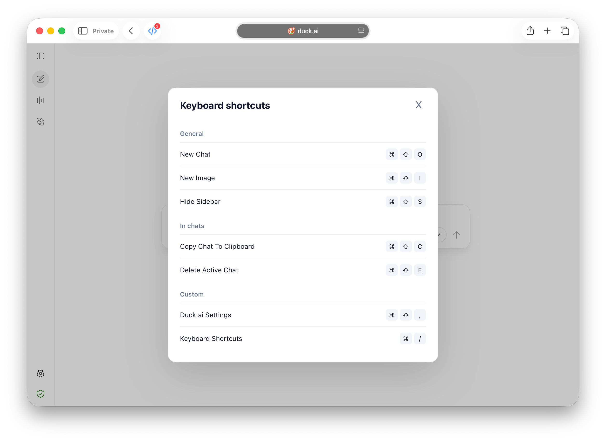

# Duck.ai Keyboard Shortcuts

A userscript that adds a keyboard shortcuts cheat sheet and a settings shortcut to Duck.ai.

    

The script is plain JavaScript with no imports, build step, or external dependencies. It uses standards-based DOM and keyboard APIs intended to stay compatible with Safari Userscripts.

Make sure the extension is allowed to run on `duck.ai`; otherwise the shortcuts will do nothing.

## Features

- **Cheat sheet**: `Cmd+/` (macOS) / `Ctrl+/` (Windows/Linux) opens a modal listing Duck.ai shortcuts
- **Settings shortcut**: `Cmd+Shift+,` (macOS) / `Ctrl+Shift+,` (Windows/Linux) opens the Duck.ai settings panel
- **Sibling awareness**: Quick Search and Quick Prompts entries appear in the cheat sheet only if those userscripts are also active

## Install

### Safari

1. Install the Userscripts Safari extension from the App Store.
2. Enable it in Safari and allow it on `https://duck.ai/`.
3. Create a new CSS file and paste in the contents of [duckai-tools.user.css](duckai-tools.user.css). Save it. This step is optional — without it the script falls back to the light theme only.
4. Create a new script and paste in the contents of [duckai-kb-shortcuts.user.js](duckai-kb-shortcuts.user.js).
5. Save, then reload `duck.ai`.

### Firefox / Orion / Helium / Chrome

1. Install Tampermonkey from the Chrome Web Store or Firefox Addons.
2. Install the [Stylus](https://add0n.com/stylus.html) extension and create a new style for `duck.ai` with the contents of [duckai-tools.user.css](duckai-tools.user.css). Save it. This step is optional — without it the script falls back to the light theme only.
3. Open the Tampermonkey dashboard and create a new userscript.
4. Replace the default contents with [duckai-kb-shortcuts.user.js](duckai-kb-shortcuts.user.js).
5. Save, confirm the script is enabled for `https://duck.ai/*`, and reload `https://duck.ai/`.

## Keyboard Shortcuts

> [!INFO]
> Shortcuts are not discovered at runtime. Instead, they are hardcoded in the script.

### Duck.AI General

| Shortcut | Action |
|----------|--------|
| `Cmd/Ctrl + Shift + O` | New Chat |
| `Cmd/Ctrl + Shift + I` | New Image |
| `Cmd/Ctrl + Shift + S` | Hide Sidebar |

### Duck.AI In Chats

| Shortcut | Action |
|----------|--------|
| `Cmd/Ctrl + Shift + C` | Copy Chat To Clipboard |
| `Cmd/Ctrl + Shift + E` | Delete Active Chat |

### Custom (this script)

| Shortcut | Action |
|----------|--------|
| `Cmd/Ctrl + /` | Open keyboard shortcuts cheat sheet |
| `Cmd/Ctrl + Shift + ,` | Open Duck.ai settings |

### Custom (sibling userscripts)

| Shortcut | Action | Requires |
|----------|--------|----------|
| `Cmd/Ctrl + K` | Quick Search | [Quick Switch](../quick-switch-userscript/README.md) |
| `Cmd/Ctrl + Shift + P` | Quick Prompts | [Quick Prompts](../quick-prompts-userscript/README.md) |
