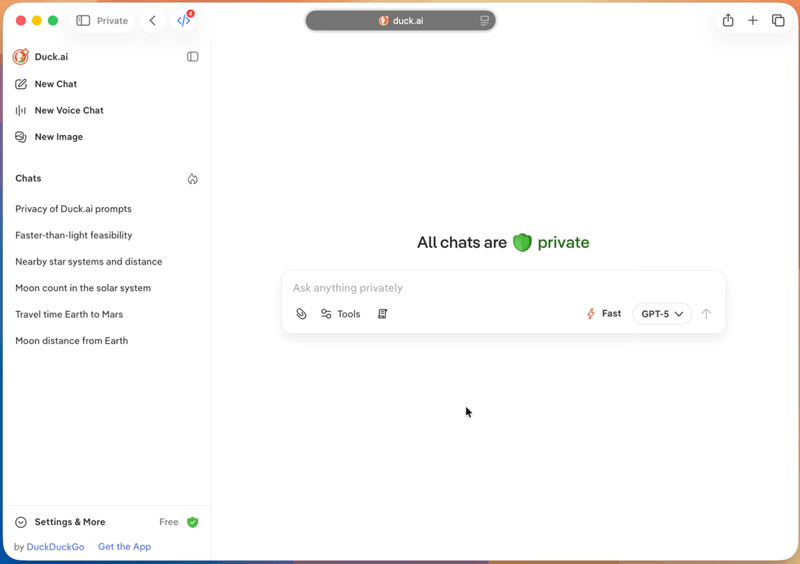

# Duck.ai Quick Prompts

A standalone userscript that adds a locally-stored quick-prompts picker to Duck.ai.

    

The script is plain JavaScript with no imports, build step, or external dependencies. It uses standards-based DOM and keyboard APIs intended to stay compatible with Safari Userscripts.

Make sure the extension is allowed to run on `duck.ai`; otherwise the shortcut will do nothing.

## Features

- **Keyboard shortcut**: `Cmd+Shift+K` (macOS) / `Ctrl+Shift+K` (Windows/Linux)
- **Fake toolbar button**: Quick prompts button inserted beside the prompt toolbar
- **Local storage**: Prompts stored in IndexedDB (`duckaiToolsQuickPrompts` database)
- **Fuzzy search**: Case-insensitive matching on prompt titles
- **CRUD operations**: Create, edit, delete, and insert prompts
- **Coexistence**: Works alongside the Quick Switch userscript

## Install

### Safari

1. Install the [Userscripts](https://itunes.apple.com/us/app/userscripts/id1463298887) Safari extension from the App Store.
2. Enable it in Safari and allow it on `https://duck.ai/`.
3. Create a new CSS file and paste in the contents of [duckai-tools.user.css](duckai-tools.user.css). Save it. This step is optional — without it the script falls back to the light theme only.
4. Create a new script and paste in the contents of [duckai-quick-prompts.user.js](duckai-quick-prompts.user.js).
5. Save, then reload `duck.ai`.

### Firefox / Orion / Helium / Chrome

1. Install [Tampermonkey](https://www.tampermonkey.net/) from the Chrome Web Store or Firefox Addons.
2. Install the [Stylus](https://add0n.com/stylus.html) extension and create a new style for `duck.ai` with the contents of [duckai-tools.user.css](duckai-tools.user.css). Save it. This step is optional — without it the script falls back to the light theme only.
3. Open the Tampermonkey dashboard and create a new userscript.
4. Replace the default contents with [duckai-quick-prompts.user.js](duckai-quick-prompts.user.js).
5. Save, confirm the script is enabled for `https://duck.ai/*`, and reload `https://duck.ai/`.

## Usage

- Press `Cmd+Shift+K` on macOS or `Ctrl+Shift+K` on Windows/Linux.
  - Or click the Quick prompts button in the prompt toolbar

### Actions

- **Search**: Type to filter saved prompts by title
- **Insert**: Click a prompt row or press Enter on a highlighted prompt
- **Add new**: Click "Add new prompt" or press Enter with no selection
- **Edit**: Click the pencil icon on a highlighted row
- **Delete**: Click the trash icon on a highlighted row

## Keyboard Shortcuts

| Shortcut | Action |
|----------|--------|
| `Cmd/Ctrl + Shift + P` | Open prompt picker |
| `Arrow Up/Down` | Navigate prompts |
| `Enter` | Insert highlighted prompt / Add new |
| `Escape` | Close picker / Cancel |
| `Cmd/Ctrl + Enter` | Save prompt (in editor) |
| `Enter` (in title) | Move focus to body textarea |

## Storage

- Database: `duckaiToolsQuickPrompts`
- Version: 1
- Object store: `prompts`
- Record schema: `{ id, title, body, createdAt, updatedAt }`
  - `id`: Auto-incrementing numeric primary key
  - `title`: Trimmed on save
  - `body`: Preserved verbatim
