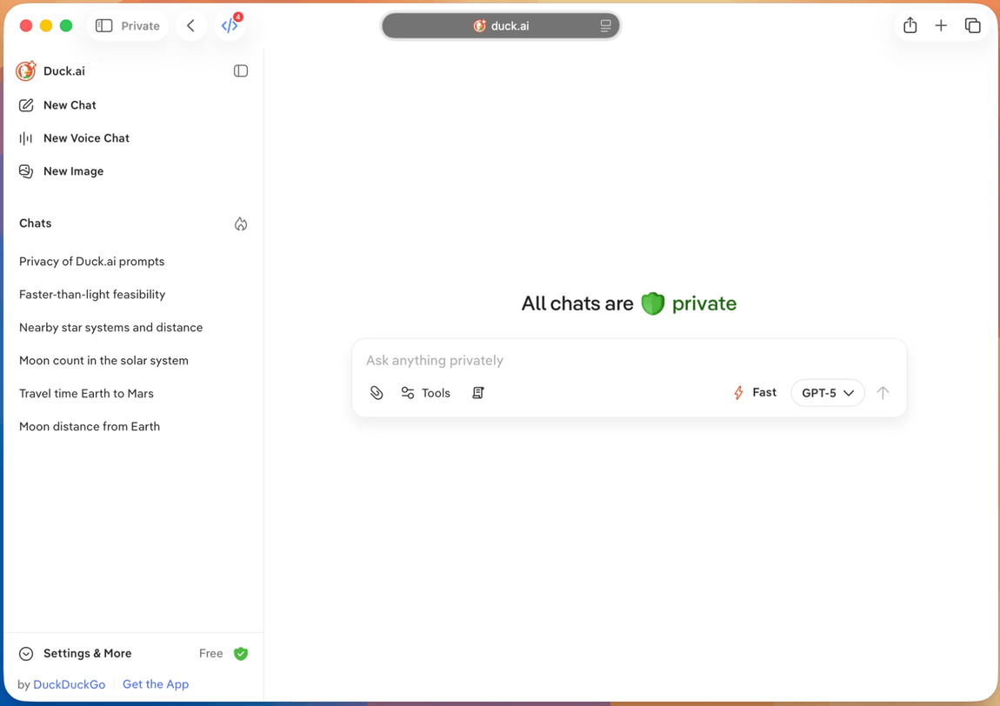

# Duck.ai Quick Switch Userscript

This userscript adds a Spotlight-style quick switcher to `duck.ai` for jumping between recent chats already rendered in the sidebar.

    

The script is plain JavaScript with no imports, build step, or external dependencies. It uses standards-based DOM and keyboard APIs intended to stay compatible with Safari Userscripts.

Make sure the extension is allowed to run on `duck.ai`; otherwise the shortcut will do nothing.

## Install

### Safari

1. Install the [Userscripts](https://itunes.apple.com/us/app/userscripts/id1463298887) Safari extension from the App Store.
2. Enable it in Safari and allow it on `https://duck.ai/`.
3. Create a new CSS file and paste in the contents of [duckai-tools.user.css](duckai-tools.user.css). Save it. This step is optional — without it the script falls back to the light theme only.
4. Create a new script and paste in the contents of [duckai-quick-switch.user.js](duckai-quick-switch.user.js).
5. Save, then reload `duck.ai`.

### Firefox / Orion / Helium / Chrome

1. Install [Tampermonkey](https://www.tampermonkey.net/) from the Chrome Web Store or Firefox Addons.
2. Install the [Stylus](https://add0n.com/stylus.html) extension and create a new style for `duck.ai` with the contents of [duckai-tools.user.css](duckai-tools.user.css). Save it. This step is optional — without it the script falls back to the light theme only.
3. Open the Tampermonkey dashboard and create a new userscript.
4. Replace the default contents with [duckai-quick-switch.user.js](duckai-quick-switch.user.js).
5. Save, confirm the script is enabled for `https://duck.ai/*`, and reload `https://duck.ai/`.

## Usage

- Press `Cmd+K` on macOS or `Ctrl+K` on Windows/Linux.
- Type at least 3 characters in the prompt.
- Use `ArrowUp` and `ArrowDown` to change selection.
- Press `Enter` to open the highlighted chat.
- Press `Escape`, click the backdrop, click the `X`, or press the shortcut again to close.

## Limitations

- Only searches chats currently rendered inside the Duck.ai recent chats sidebar.
- It does not search pinned chats.
- It does only match the chat titles (fuzzy).
