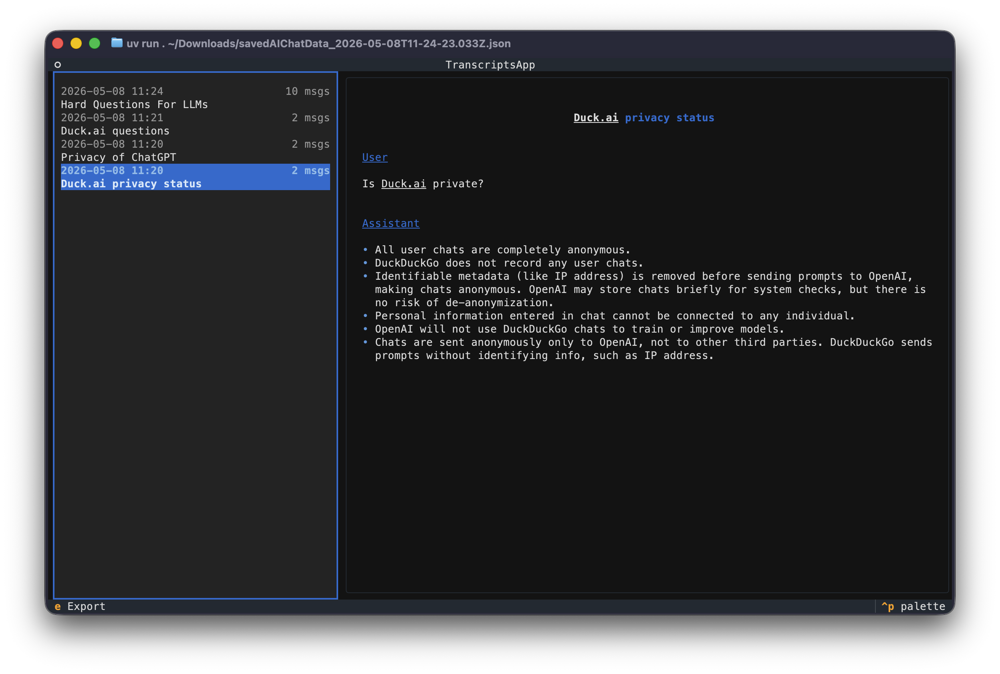
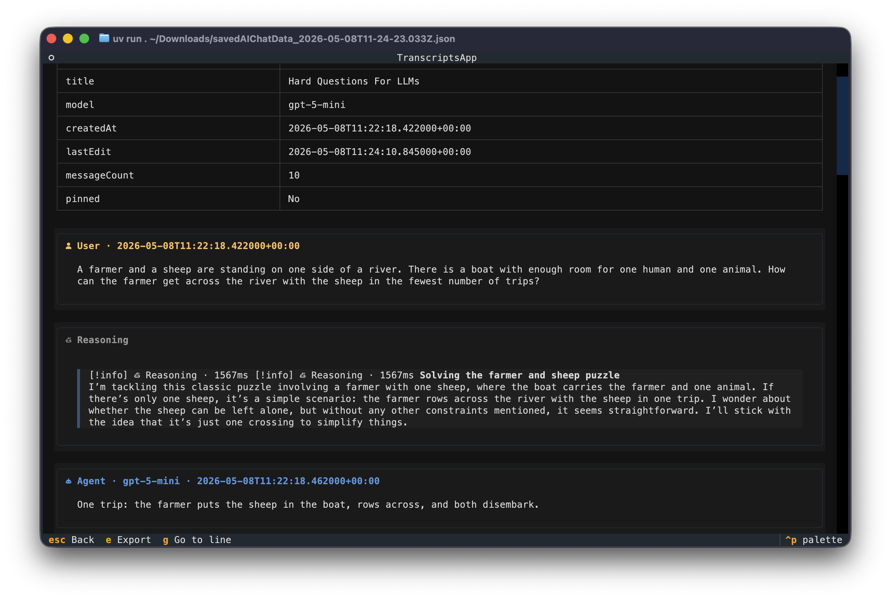
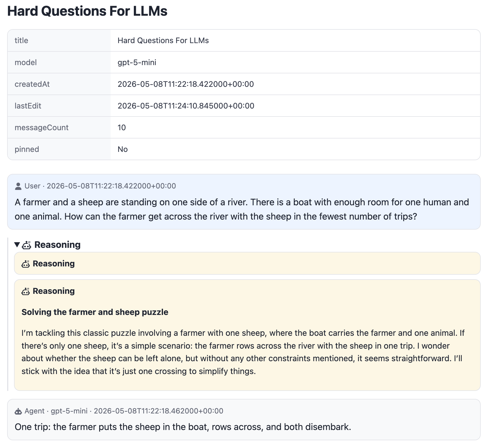
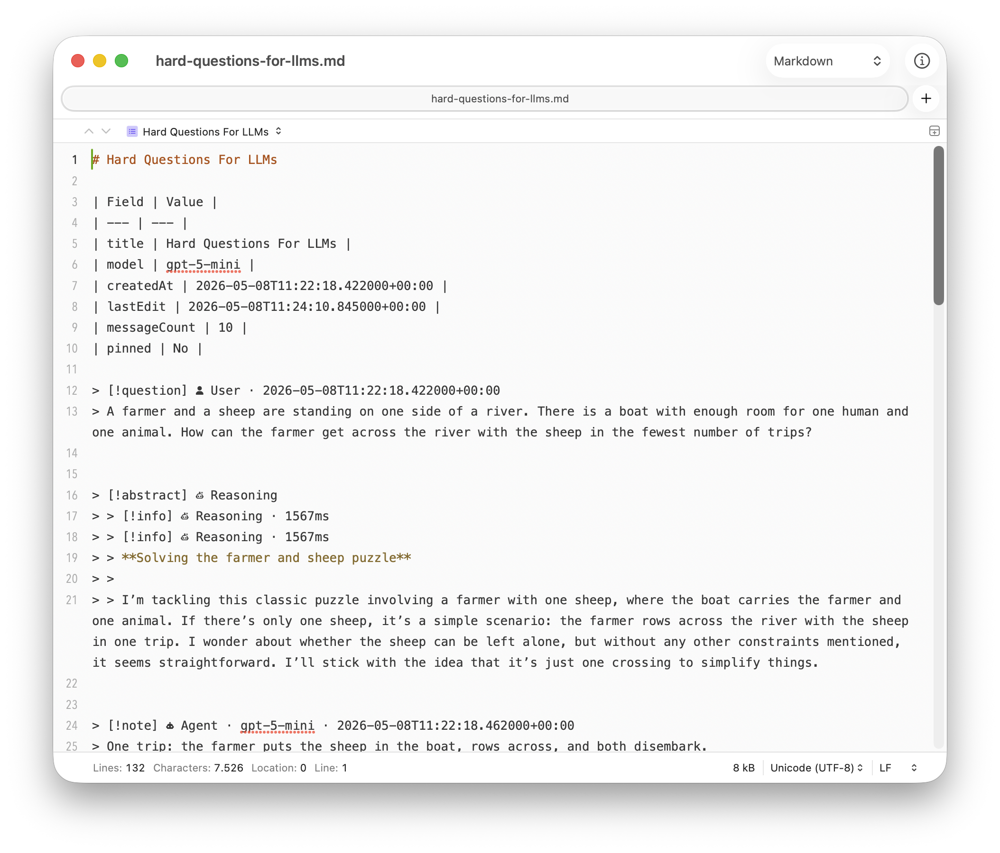

# Transcripts

A Python TUI for browsing and exporting DuckDuckGo AI Chat conversations from an export JSON file.

## How to Use It

Export your conversations with the [bookmarklet](../export-bookmarklet/README.md) first, then:

```bash
cd src/transcripts
uv run transcripts path/to/export.json
```

### Key Bindings

| Screen | Key | Action |
|---|---|---|
| List | `↑/↓` | Move selection |
| List | `Enter` | Open chat preview |
| List | `e` | Export selected chat |
| List | `ctrl + q` | Quit |
| View | `↑/↓` | Scroll |
| View | `Escape` | Back to list |
| View | `e` | Export current chat |

Export writes either Markdown or HTML. HTML exports render Markdown content (code blocks, lists, emphasis) as formatted HTML.

## Screenshots

### TUI

<div style="display: flex; gap: 10px;">
  
  
</div>

### Exports

<div style="display: flex; gap: 10px;">
  
  
</div>